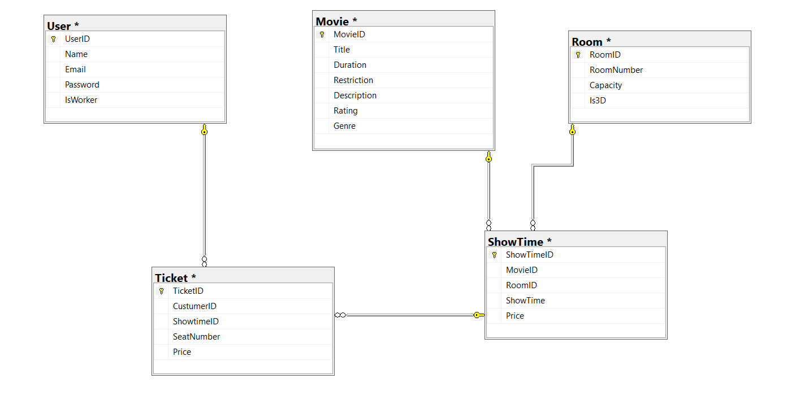

# 🎬 CinemAI: Hybrid AI Movie Recommendation System

CinemAI is an intelligent movie recommendation system built with a C# WinForms frontend, a Python AI backend, and a SQL Server relational database. It supports smart recommendations based on user preferences and watch history using AI techniques like NLP, TF-IDF, and K-Nearest Neighbors.

---

## 🟦 PART 1: C# + Windows Forms Frontend

The main interface for CinemAI is a Windows Forms application written in C#.

### 📂 Project Structure (matches screenshot)

```
├── Model
│   ├── Movie.cs
│   ├── MovieForAPI.cs
│   ├── Room.cs
│   ├── Showtime.cs
│   ├── Ticket.cs
│   └── User.cs
│
├── Repository
│   ├── RMovie.cs
│   ├── RRoom.cs
│   ├── RShowTime.cs
│   ├── RTicket.cs
│   └── RUser.cs
│
├── View
│   ├── FrmMovies.cs              👈 Main form that shows movies
│   ├── FrmSeatSelection.cs       👈 Seat booking
│   ├── FrmVDTicket.cs            👈 Ticket detail view
│   ├── FrmViewAll.cs             👈 Admin view all tickets
│   ├── FrmLogIn.cs               👈 Login page
│   └── (Others)
│
├── Resources/
│   └── Green.png / Red.png / yellow.PNG (status icons)
├── Program.cs
```

### 🧠 C# AI Integration

The app communicates with the Python Flask API by sending JSON data via HTTP.

#### 🔁 For `/recommend_from_list`:
- Gathers movies from SQL using `RMovie.getAll()`
- Builds `MovieForAPI` objects with title, genre, and description
- Sends user input text + list of movies to the Flask API
- Displays returned movie in a label (e.g., "Try: Shrek")

#### 🔁 For `/recommend_by_history`:
- Uses `RTicket.GetWatchedMoviesByUserId(userId)`
- Sends watched + all movies to the API
- Displays the top recommendation for the user at login

---

## 🟩 PART 2: Python Flask AI Backend

The backend logic is written in Python and uses Flask to expose two smart endpoints.

### 🧠 AI Concepts Used

| Concept | Description |
|--------|-------------|
| **TextBlob** | Fixes typos in input like “romnatic” |
| **Fuzzy NLP** | Extracts genres using synonyms and near-matches |
| **TF-IDF** | Encodes movie descriptions into numeric vectors |
| **Cosine Similarity** | Measures semantic distance between text |
| **KNN** | Recommends similar movies to previously watched ones |
| **Hybrid Scoring** | Combines genre matching (60%) + text similarity (40%) |

---

### 📬 Flask Endpoints

#### 1. `/recommend_from_list` — NLP from user text

Input:
```json
{
  "text": "I want a romantic comedy",
  "movies": [{ "title": "...", "genre": "...", "description": "..." }]
}
```

Output:
```json
{ "recommendations": ["The Notebook"] }
```

#### 2. `/recommend_by_history` — Based on watched movies

Input:
```json
{
  "watched": [ ... ],
  "all_movies": [ ... ]
}
```

Output:
```json
{ "recommendations": ["Titanic"] }
```

✅ Includes fallback when input is unclear  
✅ Automatically removes already-watched movies

---

## 🟨 PART 3: SQL Server Relational Database

The app uses a normalized relational schema for all core data.

### 🧱 Tables

- `User` – stores login info and user role
- `Movie` – movie catalog (title, description, genre, rating, etc.)
- `Room` – theater rooms with 3D flag
- `Showtime` – specific movie showings
- `Ticket` – purchased tickets (links user → showtime → movie)

### 🔑 Relationships

- A `Ticket` links a `CustumerID` (user) to a `Showtime`
- A `Showtime` links to a `Movie` and a `Room`
- Movie genre info is used by the AI in the recommendation process

### 🖼️ Database Diagram



---

### 🗂️ Additional: `app_large.py` – AI Testing with External Dataset

The file `app_large.py` is an alternative version of the Flask API that does **not depend on the SQL Server or the C# application**. Instead, it loads a large dataset of over 5,000 movies directly from a `.csv` file (`large_movies.csv`) and performs recommendations purely in Python.

This version is used for **offline testing and evaluation**, and it supports the same endpoints (`/recommend_from_list_large`, `/recommend_by_history_large`) with the same hybrid AI logic (genres + descriptions).

#### 📚 Dataset Source (for `large_movies.csv`)
> TMDB 5000 Movie Dataset  
> https://www.kaggle.com/datasets/tmdb/tmdb-movie-metadata  
> Provided by The Movie Database (TMDb) via Kaggle, licensed for academic and non-commercial use.

This allows the project to demonstrate its AI capabilities on **external, realistic movie data** beyond the SQL-bound system.

---

## ✅ Technologies Used

| Layer        | Tools |
|--------------|-------|
| Frontend     | C#, WinForms |
| Backend (AI) | Python, Flask, scikit-learn |
| NLP          | TextBlob, TF-IDF, cosine similarity |
| Database     | SQL Server |
| API          | JSON over HTTP (via `HttpClient` in C#) |

---

## 🧠 Authors

**Germano Correa Silva de Carvalho**  
**Parker Nunley**

University of West Florida  
CAP 4601 – Introduction to Artificial Intelligence  
Spring 2025
