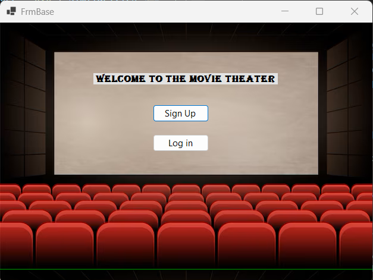
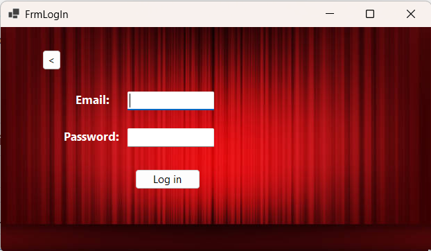
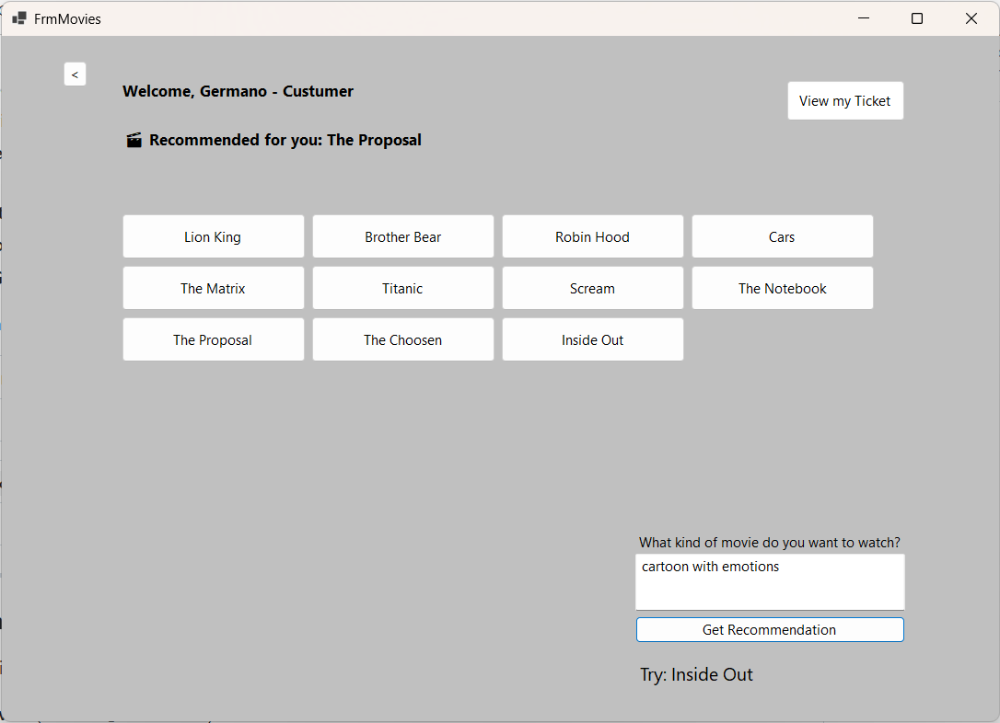
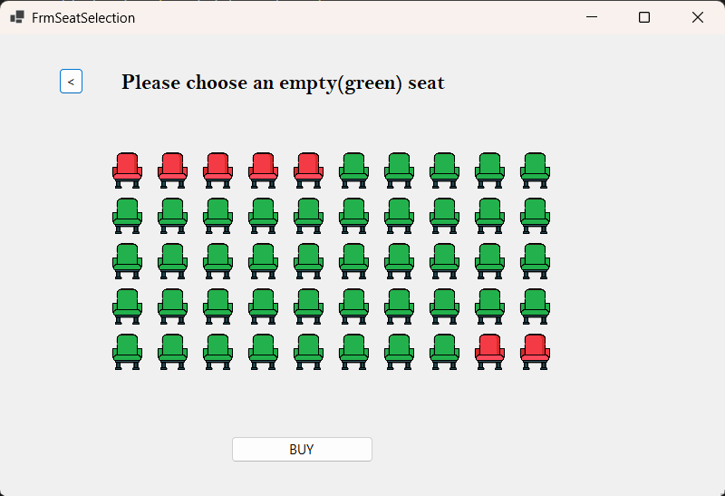
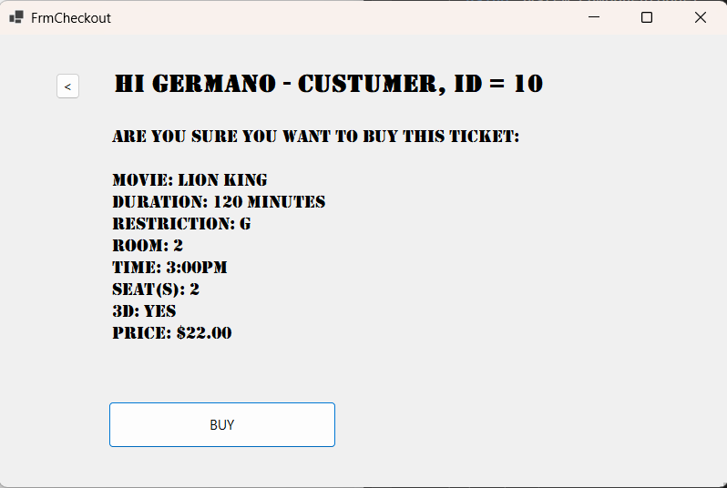
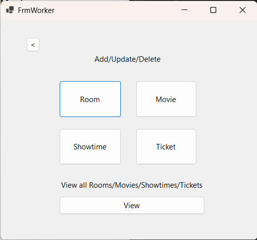
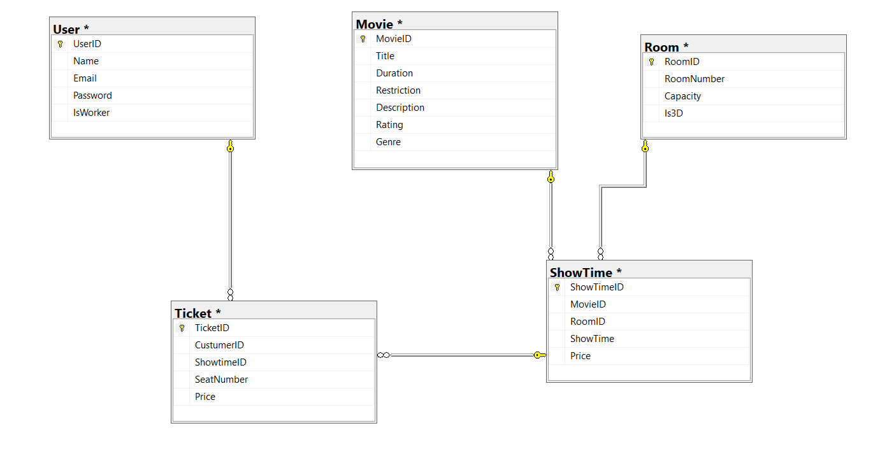

# 🎬 CinemAI – Movie Theater Ticketing System with AI-Powered Movie Recommendations

**CinemAI** is a complete desktop application for movie browsing, intelligent recommendations, ticket purchasing, and theater management. Built using **C# Windows Forms**, **Python Flask**, and **SQL Server**, it offers an intuitive interface for both customers and administrators.

---

## 🟦 PART 1: C# Windows Forms Frontend

The frontend is developed with **C# and WinForms**, split into two interfaces: one for customers and another for staff.

### 👤 User Interface (Customers)
All customer features are centralized in a clean, unified experience via `FrmMovies.cs`.

- 🔐 **Sign Up / Log In** (`FrmLogIn.cs`)
- 🎬 **Browse Movies** – View posters, descriptions, genres
- 🧠 **AI Recommendation** – Enter a query and get a suggested movie, and check the reccomendation based on user profile
- ⏰ **Select Showtime** – Choose a date/time for your preferred movie
- 🪑 **Seat Selection** – Interactive map to choose seats (`FrmSeatSelection.cs`)
- 🎫 **PDF Ticket Generation** – Confirm booking and get a printable ticket (`FrmVDTicket.cs`)

📸 **Sample Screenshots:**

| `FrmLogIn.cs` (Login) | `FrmMovies.cs` (Movie Browser + AI) |
|-----------------------|--------------------------------------|
|  |  |

| `FrmSeatSelection.cs` (Seat Map) | `FrmVDTicket.cs` (Ticket Confirmation) |
|----------------------------------|-----------------------------------------|
|  |  |

---

### 🛠️ Worker/Admin Interface

When a **worker** logs in, CinemAI switches to **admin mode**, allowing theater staff to manage all core data.

- 📽️ **Manage Movies** (`FrmManageMovies.cs`)
- 🧍‍♂️ **Manage Users** (`FrmManageUsers.cs`)
- 🏛️ **Manage Rooms** (`FrmManageRooms.cs`)
- 📆 **Manage Showtimes** (`FrmManageShowtimes.cs`)
- 🎟️ **View Tickets** (`FrmViewAll.cs`)

📸 **Sample Screenshots:**

---

## 🟩 PART 2: Python Flask AI Backend

CinemAI uses a **Flask API** with **Natural Language Processing (NLP)** and **Machine Learning** to generate movie recommendations.

### 🔍 AI Techniques
- **TextBlob** – Corrects typos (e.g., “romnatic” → *romantic*)
- **Fuzzy NLP** – Matches genres from input
- **TF-IDF + Cosine Similarity** – Understands movie descriptions
- **KNN** – Finds similar movies based on past watches
- **Hybrid Scoring** – 60% genre match, 40% description match

### 🔌 Endpoints
- `/recommend_from_list` – Uses user text + movie data to suggest a title
- `/recommend_by_history` – Uses watch history + all movies to suggest what's next

⚙️ The C# app communicates with these endpoints using `HttpClient` and displays the response directly in the interface (`FrmMovies.cs`).

---

## 🟨 PART 3: SQL Server Database

The database is a **normalized relational schema** that holds all business logic data.

### 🧱 Core Tables
| Table     | Description |
|-----------|-------------|
| `User`    | Login credentials and roles |
| `Movie`   | Movie title, genre, description, rating |
| `Room`    | Room info with 3D support |
| `Showtime`| Date/time info tied to rooms & movies |
| `Ticket`  | Links users to seats, showtimes, and movies |

🧠 Movie data (especially genres and descriptions) are used by the AI backend.

🖼️ **Entity Relationship Diagram:**  

---

## 🗂️ PART 4: `app_large.py` – Testing AI with External Dataset

The file `app_large.py` runs an alternate version of the Flask API that uses a dataset of 5,000+ movies from **TMDB** (via Kaggle), independent of SQL or C#.

- ✅ For testing AI at scale
- ✅ Endpoints: `/recommend_from_list_large`, `/recommend_by_history_large`

📚 **Dataset Source:**  
[TMDB 5000 Movie Dataset – Kaggle](https://www.kaggle.com/datasets/tmdb/tmdb-movie-metadata)

---

## ✅ Tech Stack

| Layer        | Tools |
|--------------|-------|
| Frontend     | C#, Windows Forms |
| Backend (AI) | Python, Flask, scikit-learn |
| NLP & ML     | TextBlob, TF-IDF, cosine similarity, KNN |
| Database     | SQL Server |
| Integration  | JSON over HTTP (via `HttpClient`) |
| PDF Export   | iTextSharp (C#) |

---

## 👨‍💻 Author

**Germano Correa Silva de Carvalho**  
University of West Florida  
Course: CAP 4601 – Introduction to Artificial Intelligence  
Spring 2025  
GitHub: [Germano1234](https://github.com/Germano1234)

---

> 📝 **Note:** CinemAI was originally developed for an AI course, but has grown into a full-featured cinema management system with intelligent features and real-world integration.
